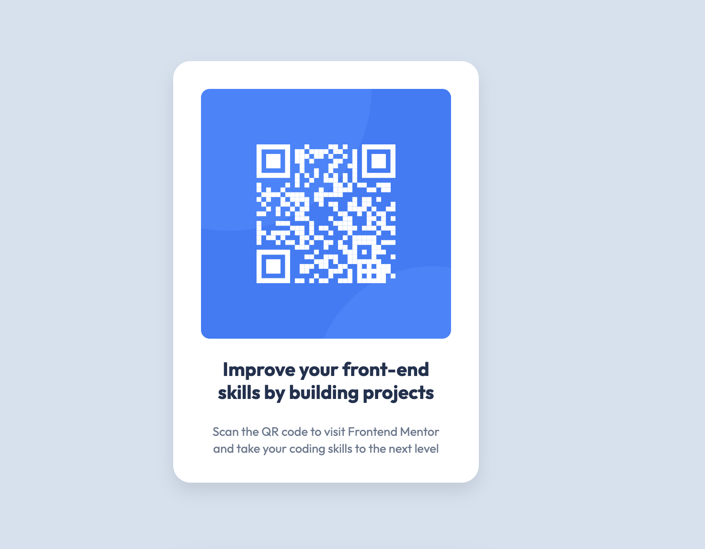

# Recipe Page

Bu proje, [Frontend Mentor](https://www.frontendmentor.io) platformundaki [QR Code Component](https://www.frontendmentor.io/challenges/qr-code-component-iux_sIO_H) tasarımının birebir uygulanmasıdır.

## 💡 Açıklama
Bu sayfa, klasik bir QR kodunun şık bir kart tasarımı içinde nasıl sunulabileceğini göstermektedir.

## 🛠️ Kullanılan Teknolojiler

- HTML5
- CSS3
- Responsive Web Design