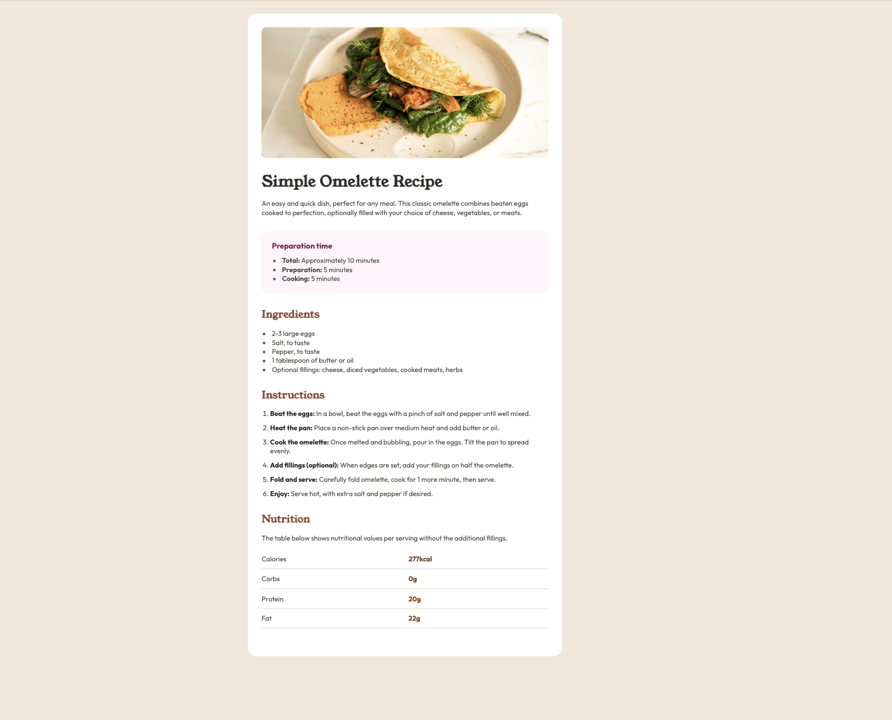

# Recipe Page

Bu proje, [Frontend Mentor](https://www.frontendmentor.io) platformundaki [Recipe Page](https://www.frontendmentor.io/challenges/recipe-page-KiTsR8QQKm) tasarımının birebir uygulanmasıdır.

## 💡 Açıklama

Bu sayfa, klasik bir omlet tarifini şık ve okunabilir bir şekilde sunmayı amaçlamaktadır. Proje boyunca HTML ve CSS kullanılarak responsive (mobil uyumlu) bir yapı oluşturulmuştur.

## 🛠️ Kullanılan Teknolojiler

- HTML5
- CSS3
- Responsive Web Design (Mobil: 375px, Desktop: 1440px)